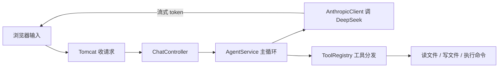
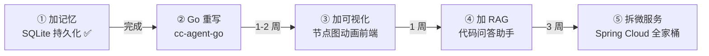

# 00 · 总览与路线图

> 这是 cc-agent-java 学习文档的**索引页**。先读这一篇，搞清楚整个项目要往哪走、5 篇文档怎么配合，再按编号一篇篇往下啃。

---

## 1. 这个项目是什么

cc-agent-java 是一个 **Java + Spring Boot 写的 AI Agent**：你输入一句话，它调用 DeepSeek 大模型，模型可以"读文件 / 写文件 / 执行命令"，多轮循环直到把任务做完，结果以流式（一个字一个字往外蹦）返回给前端。

目标不是做产品，是**学 Java / Spring Boot 生态，为留日求职攒简历**。所以每加一个功能，都同时问两件事：①这个功能本身有没有用 ②学到的技术在面试 / 简历上值不值钱。

### 当前已经跑通的链路



一句话：**输入 → Tomcat → AgentService → AnthropicClient → 工具 → 流式回复**。这套已经能用了，下面 4 个阶段是往上加东西。

---

## 2. 五阶段路线图

整个学习计划分 5 个阶段，**从近到远、从简单到复杂**，对应文档 01～05：



**为什么在这个时间点插 Go 重写**：
1. Java 版阶段 1 已完成（存储、压缩、会话管理），业务逻辑够用
2. 同一个项目逻辑，用 Go 重写是最快的学习路径——不需要重新想需求，精力全在 Go 语法和标准库上
3. Go 在日本的招聘市场需求旺盛（基础设施、CLI 工具、微服务网关方向）
4. 之后的可视化、RAG、微服务化可以选 Java 或 Go 实现，两边都能积累

**为什么是这个顺序**（很重要，别乱跳）：

1. **先加记忆（01）**：是所有后续功能的数据基础。✅ 已完成。
2. **再 Go 重写（02）**：巩固对 Agent 架构的理解，同时掌握 Go 语言。同一个项目写两遍，对比 Java/Spring 和 Go 标准库的差异，收获最大。
3. **然后加可视化（03）**：这是个"自己看自己"的学习神器——后面每加一个功能，都能在动画里看到数据怎么流，反馈环最快。
4. **接着加 RAG（04）**：它只是在单体里加几个新文件，不动现有架构，风险小。
5. **最后才拆微服务（05）**：这是**架构级重构**，要拆服务、写 Dockerfile、起 Nacos。**必须等单体功能全做完再拆**——这叫"演化式架构"。反过来先拆服务再加功能，等于自己给自己挖坑（每加一个功能都要决定放哪个服务、怎么跨服务调用）。

> 一句话记住：**先把单体喂饱，再大卸八块。**

---

## 3. 六篇文档索引

| 编号 | 文档 | 一句话导读 | 阶段 |
|---|---|---|---|
| 00 | 本篇 | 全局地图 + C++ 转 Java 心智小抄 | 索引 |
| [01](01-跨请求记忆-SQLite-JPA.md) | 跨请求记忆（SQLite + JPA） | 让 Agent 记住上一句话，重启也不丢；学 JPA/Hibernate（Java 求职刚需） | ✅ 完成 |
| 02 | Go 语言重写（cc-agent-go） | 用 Go 标准库重写 Agent 核心链路；学 goroutine/channel/net/http | **← 当前** |
| [03](02-实时可视化-SSE-Cytoscape.md) | 实时可视化（SSE + Cytoscape） | 用节点图动画把"组件怎么协作"画出来；学命名 SSE 事件 | 下一步 |
| [04](03-RAG-代码问答助手.md) | RAG 代码问答助手 | 让 Agent 能回答"我这项目的代码是怎么写的"；学 Embedding / 向量检索 | 后续 |
| [05](04-微服务化-SpringCloud.md) | 微服务化（Spring Cloud） | 把单体拆成 4 个服务；学 Nacos / Gateway / Feign / 熔断 / 链路追踪 | 终极 |

每篇文档都是同样的 4 节结构，方便你定位：

1. **任务目标与背景** —— 解决什么痛点
2. **要学的技术 + 基本语法** —— 每个概念配一个 **C++ 类比**
3. **实施步骤** —— 改哪些文件、关键代码、怎么自测
4. **GPT 画图提示词模板** —— 复制粘贴就能让 GPT/Gemini 出 Mermaid 图

---

## 4. C++ 开发者快速上手 Java/Spring 心智地图（小抄）

你有 C++ 后端 / 中间件背景，下面这张对照表帮你把已有经验"接"到 Java/Spring 上。**不用背，看不懂的概念回头查这张表。**

| Java / Spring 概念 | C++ / 后端类比 | 一句话说明 |
|---|---|---|
| JVM | 带 GC 的托管运行时 | 字节码跑在虚拟机上，内存自动回收，不用 `delete` |
| Gradle / Maven | CMake + vcpkg/conan | 构建 + 依赖管理二合一，`build.gradle` ≈ `CMakeLists.txt` |
| 包（package） | 命名空间 namespace | `com.example.ccagent.service` ≈ 目录式 namespace |
| 注解 `@Xxx` | 编译期/运行期元数据标签 | 像给类/方法贴标签，框架扫描标签决定怎么处理它 |
| Spring 容器 | 一个全局对象工厂 + 注册表 | 启动时扫描所有 `@Component`，new 好存起来，谁要谁拿 |
| 依赖注入 `@Autowired` | 构造时把依赖的指针/引用传进来 | 你不自己 `new`，容器把现成对象塞给你的字段 |
| Bean（单例） | 进程内的全局单例对象 | 默认整个进程只有一个实例，传的是引用不是拷贝 |
| `interface` + 实现类 | 纯虚基类 + 派生类 | Java 的 `interface` ≈ 全是纯虚函数的抽象类 |
| `record` | 不可变 `struct` + 自动生成的构造/比较 | 编译器帮你生成构造函数、getter、`equals`、`toString` |
| `Optional<T>` | `std::optional<T>` | 显式表达"可能没有值"，逼你处理 null |
| `Stream` API | range / 算法库（`std::ranges`） | `list.stream().map().filter().toList()` ≈ 管道式数据处理 |
| `CompletableFuture` | `std::future` / `std::async` | 异步任务的句柄，`.thenApply()` ≈ 链式回调 |
| 异常 `try/catch` | 一样 | 概念基本一致，Java 区分 checked / unchecked 异常 |

> **最关键的一条**：Spring 的核心魔法就是"**你别自己 new 对象，交给容器**"。看到 `@Component`/`@Service`/`@Autowired` 就想——"哦，这个对象是容器在启动时造好、运行时塞给我的"。理解这一条，Spring 就懂了一半。

---

## 5. 怎么用这套文档

- **想动手做**：从 01 开始，照着"实施步骤"改代码，用"自测命令"验证。
- **想补基础**：每篇第 2 节"要学的技术"是速查表，配合 [docs/java-learning-notes.md](java-learning-notes.md) 深入。
- **想画图理解**：每篇第 4 节有现成提示词，丢给 GPT/Gemini 出 Mermaid 图，贴回文档里。
- **写代码注释**：保持 [docs/comment-style.md](comment-style.md) 的"大白话 + C++ 类比"风格。

---

## 附：本篇用到的画图提示词模板（模板 A · 流程图）

想重新生成上面的"四阶段路线图"，把下面这段复制给 GPT/Gemini：

```
你是软件架构图助手。请用 Mermaid 的 flowchart 语法画一张【4 阶段演化路线图】，要求：
- 4 个阶段从左到右排列：①单体加记忆 ②单体加可视化 ③单体加 RAG ④拆微服务
- 每个阶段节点下方用 <br/> 附一行该阶段产出（如"SQLite 持久化"）
- 阶段之间用箭头连接，并在箭头上标注大致工期
- 只输出 ```mermaid 代码块，不要任何解释文字
```

> 所有文档的画图提示词都遵循同一套路：①声明角色 ②指定 Mermaid 图类型 ③逐条列出要画的节点 / 边 ④限定"只输出 mermaid 代码块"。学会这个套路，你能让 GPT 画任何图。
